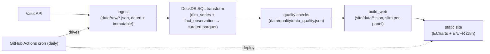

# Inflation Tracker — Design Spec

> **Bank of Canada Monetary-Policy Transmission Dashboard**
> Status: **Approved** (2026-07-14) · Owner: said-rustom · Solo · Portfolio piece
> Source of truth: [Notion — Inflation Tracker](https://app.notion.com/p/39dcea51fedf81028e24e6f748c1482b)

---

## 1. Purpose

A free, public, **bilingual (EN/FR)** web dashboard built on the **Bank of Canada Valet API** that
visualizes the **monetary-policy transmission chain**:

> policy rate → overnight funding (CORRA) → benchmark GoC bond yields → chartered-bank lending rates → CPI vs the 1–3% inflation-control target

It is built as an **end-to-end data product** — ingestion → transformation → data-quality → visualization —
not merely a set of charts. It is a portfolio piece to attach to a **Bank of Canada — Developer
(Data Operations)** application.

### Why this shape (job-fit rationale)

The target role centers on **Python + SQL data pipelines on Databricks/Spark, ETL, and data quality**;
data visualization (Power BI/Tableau) is a *nice-to-have*. The design therefore **leads with pipeline
and data-quality rigor**, with the dashboard as the visible payoff. Concept #1 was chosen (over nine
alternatives) precisely because it forces real data-engineering work: multi-frequency joins,
null/holiday/revision handling, and freshness validation — and because the transmission chain *is* the
Bank's core mandate rendered as data.

Target role: [Developer — Data Operations (Ottawa, Downtown)](https://careers.bankofcanada.ca/job/Ottawa-%28Downtown%29-Developer-ON/604198117/)

## 2. Goals & non-goals

**Goals**
- Tell the transmission story clearly, top-to-bottom, on one fast-loading page.
- Demonstrate a genuine Python + SQL pipeline (DuckDB), with tests, CI, and scheduled orchestration.
- Prove data-quality thinking with a visible **Data-Trust** tab and CI that fails on bad data.
- Ship **bilingual EN/FR** — signalling awareness of the Bank's bilingual federal context.
- Be trivially hostable and always-live for a reviewer (free infrastructure, no server to babysit).

**Non-goals / bright lines (YAGNI)**
- **No financial advice, no rate predictions, no "lock-in" nudges.** Descriptive only, with a disclaimer.
- **No user accounts, no server, no database service.** The site is static; the pipeline is file-based.
- **BoC Valet is the only external data source.** No CREA/Teranet/MLS/market-data vendors.
- Daily cadence, not intraday/real-time.
- Never present a *posted* rate as a usable/consumer rate; the household panel uses **actual** chartered-bank
  effective rates from the A4 series, and any yield→rate relationship is shown **descriptively** (observed spread),
  never as a derived prediction.

## 3. Architecture

A layered data product driven by CI. Four file-based, idempotent stages; any stage runs and tests alone.



Because raw snapshots are immutable and dated, a failed refresh **never publishes an empty or half-built
page** — it keeps the last good data. The cron job is the **orchestration story** (the Airflow /
Databricks Jobs analog).

## 4. Repository layout

```
InflationTracker/
  README.md               # reviewer's front door — frames the pipeline in the JD's language
  CLAUDE.md               # house rules + Notion pointer (source of truth)
  pyproject.toml          # httpx, duckdb, pydantic, pytest, ruff  (managed with uv)
  config/
    series.yml            # series/group IDs + EN/FR labels + frequency + role in the chain
    settings.yml          # date range, quality thresholds, spread definition
  pipeline/
    valet_client.py       # thin Valet wrapper: retry/backoff, terms compliance
    ingest.py             # pull per config → data/raw/YYYY-MM-DD/*.json (immutable)
    transform.sql         # DuckDB SQL: raw → dim_series + fact_observation → curated
    transform.py          # executes SQL, writes data/curated/*.parquet
    quality.py            # freshness/null/range/monotonic/revision → data/quality/*.json
    build_web.py          # curated → site/data/*.json (slim, per-panel)
    models.py             # pydantic schemas for observations + config
  data/
    raw/                  # landed API responses (git-tracked snapshots, dated)
    curated/              # parquet
    quality/              # data_quality.json
  site/                   # GitHub Pages root (no build step)
    index.html
    assets/{css, js, echarts}
    i18n/{en.json, fr.json}
    data/                 # published JSON the page fetches (built artifact)
  tests/
    test_valet_client.py  test_transform.py  test_quality.py  golden/
  docs/
    superpowers/specs/2026-07-14-inflation-tracker-design.md
    methodology.md        # Mermaid lineage, spread method, series catalog
  .github/workflows/
    ci.yml                # ruff + pytest on PR
    refresh.yml           # cron: ingest→transform→quality→commit→deploy Pages
```

## 5. Components (units + interfaces)

| Unit | Purpose | Interface (sketch) | Depends on |
|---|---|---|---|
| `valet_client.py` | Fetch observations for a series/group; retry/backoff; honor BoC terms | `get_observations(name, start=None, recent=None) -> dict` | httpx |
| `ingest.py` | Pull everything in `series.yml`; land immutable dated raw JSON | `run_ingest(config) -> list[Path]` | client, config |
| `transform.sql` / `transform.py` | Normalize raw → `dim_series` + `fact_observation`; compute observed spread; write curated parquet | `run_transform() -> None` | duckdb |
| `quality.py` | Run checks; per-series OK/WARN/FAIL + message; non-zero exit on FAIL | `run_quality() -> QualityReport` | duckdb |
| `build_web.py` | Shape curated data into slim per-panel JSON | `build_web() -> None` | duckdb |
| `site/` | Render panels from published JSON; EN/FR; no framework | (browser) | ECharts |

Each unit is independently understandable and testable: the client mocks HTTP, the transform runs on a
fixed golden sample, quality runs on synthetic series.

## 6. Data model (curated)

- **`dim_series`** — `series_id` (PK), `label_en`, `label_fr`, `frequency`, `role` (policy / funding /
  yield / lending / inflation / target), `source_url`.
- **`fact_observation`** — `series_id` (FK), `date`, `value` (nullable), `is_null` (bool), `ingested_at`.

Panels are assembled by joining facts to the series dimension and aligning frequencies with **as-of joins**
onto a per-panel date spine (monthly CPI vs daily rates handled explicitly, never silently resampled).

## 7. Verified Valet series (checked live 2026-07-13/14)

| Purpose | Series / Group | Frequency |
|---|---|---|
| Policy rate (target overnight) | `V39079` — 2.25% on 2026-07-13 | Daily (8 fixed dates) |
| Overnight funding | `AVG.INTWO` (CORRA) | Daily |
| Benchmark GoC yields | group `bond_yields_benchmark` (2/3/5/7/10yr) | Daily (business days) |
| Chartered-bank lending rates | `A4_RATES_MORTGAGES`, `A4_RATES_CONSUMER` | Weekly/Monthly |
| Core inflation vs target | `CPI_TRIM`, `CPI_MEDIAN`, `CPI_COMMON` (group `ATABLE_INFLATIOON_INDICATORS`) | Monthly |
| Headline inflation vs target | `STATIC_TOTALCPICHANGE` — 3.2% on 2026-05-01 *(verified live 2026-07-15)* | Monthly |

Base: `https://www.bankofcanada.ca/valet/` · no auth · JSON/CSV/XML · `?recent=N` / `start_date`/`end_date`.
**Series IDs live in `config/series.yml`, not code.** Precedent for churn: BoC discontinued the monthly
chartered-bank series in Oct 2019 — treat "a series can disappear" as a real risk (staleness alarm).

## 8. Panels (the transmission story)

1. **Policy & funding** — target overnight rate (`V39079`) + CORRA (`AVG.INTWO`), step chart.
2. **To markets** — benchmark GoC yields (2/5/10yr) vs policy rate; mini yield-curve with **2s10s slope +
   inversion flag**.
3. **To households** — actual chartered-bank mortgage/consumer lending rates (`A4_RATES_*`) vs the 5yr yield,
   with the **observed spread** (descriptive).
4. **The target** — headline CPI + core (trim/median/common) against the shaded **1–3% band** + a
   "months inside band" indicator.
5. **Data-Trust tab** — freshness / null-gaps / revisions per series from `data_quality.json`; a red/amber/green
   status board + "last refreshed" timestamp.
6. **Methodology** — Mermaid lineage diagram, spread definition, series catalog (generated from `config`).

## 9. Data-quality checks (the Data-Trust tab + CI gate)

Per series, `quality.py` emits OK / WARN / FAIL with a human-readable message:

- **Freshness** — latest observation within the expected cadence (daily/weekly/monthly + holiday allowance).
- **Null / gap ratio** — share of null or missing observations over a trailing window.
- **Value range** — sanity bounds per role (e.g. a policy rate outside a plausible band is FAIL).
- **Date monotonicity** — dates strictly increasing, no duplicates.
- **Revision diff** — values that changed vs the previous snapshot (revisions surfaced, not hidden).

Hard violations return a **non-zero exit code** so the refresh workflow alarms; the report also renders on
the Data-Trust tab. This is the JD's "data quality patterns / validation / metadata" made visible.

## 10. Error handling & edge cases

- **API failure** — retry with backoff; on total failure keep the last good raw snapshot; never publish empty.
- **Nulls / holidays** — carried explicitly as `is_null`; forward-filled only for display, never silently.
- **Series disappears / stale** — quality FAIL → Data-Trust tab **and** CI failure.
- **Frequency mismatch** — explicit as-of joins on a per-panel date spine.
- **Terms compliance** — BoC attribution + terms link; polite daily request cadence.

## 11. Testing

- **Unit** — `valet_client` (mocked HTTP), `transform` (golden sample in→out), `quality` (synthetic series
  tripping each WARN/FAIL).
- **Golden math** — the observed-spread computation and the 2s10s / inversion logic.
- **CI** (`ci.yml`) — ruff + pytest on every PR.
- **Refresh** (`refresh.yml`) — runs the pipeline, fails on quality FAIL, commits refreshed data, deploys
  Pages. A **green CI badge** goes in the README.

## 12. Hosting, i18n & CI/CD

- **Hosting** — GitHub Pages serves `site/`. No server, no DB.
- **i18n** — EN/FR dictionaries in `site/i18n/`, culture via **query parameter (`?lang=en|fr`)**; the series
  dimension carries `label_en` / `label_fr`.
  > **Amended 2026-07-15.** Originally specified as a URL segment (`/en`, `/fr`). With no build step,
  > segments would mean duplicating the HTML shell per language. `?lang=` stays a real, shareable URL.
  > See the decisions log.
- **Orchestration** — GitHub Actions cron (daily) runs the pipeline and redeploys.

## 13. Milestones (v1)

- **M0 Foundations** — repo scaffold, `pyproject`, config-driven `series.yml`, CI skeleton, README + disclaimer.
- **M1 Pipeline core** — `valet_client` + `ingest` + DuckDB `transform` + curated parquet; golden tests. *Ships a working pipeline.*
- **M2 Quality + web build** — `quality.py` + `data_quality.json`; `build_web.py` slim JSON.
- **M3 Dashboard** — static site, ECharts panels 1–4, bilingual EN/FR.
- **M4 Data-Trust + methodology + deploy** — Data-Trust tab, methodology page, GitHub Actions cron + Pages, CI badge.

## 14. Risk register

| Risk | Mitigation |
|---|---|
| A Valet series is discontinued/renamed | Config-driven IDs + staleness FAIL alarm; methodology lists sources |
| Reviewer opens the site while Valet is down | Static site reads committed data, not the live API — always renders |
| Bilingual scope creep | Dictionaries + `label_en`/`label_fr` from day one; no late retrofit |
| Over-investing in frontend | Vanilla + ECharts, no framework/build; effort stays on the pipeline |
| CORS / terms concerns | No browser calls to Valet; server-side pull only, with attribution |

## 15. Decisions log

- **Stack:** Hybrid — Python + SQL pipeline + best-in-class self-contained UI. *(2026-07-14)*
- **Data flow:** Scheduled pipeline → static site (GitHub Actions cron → committed data → Pages). *(2026-07-14)*
- **Architecture:** Approach A ("data product + custom dashboard") over Evidence.dev / SPA. *(2026-07-14)*
- **V1 scope:** core transmission dashboard + Data-Trust tab + SQL-first DuckDB transforms with tests/CI +
  bilingual EN/FR + methodology/lineage writeup. *(2026-07-14)*
- **i18n via `?lang=en|fr`, not `/en` `/fr` URL segments.** The site has no build step, so URL segments
  would require duplicating the HTML shell per language for no reader-visible gain; `?lang=` is still a
  real shareable link. **Amends §12.** *(2026-07-15)*
- **Headline CPI (`STATIC_TOTALCPICHANGE`) added to `config/series.yml` under a new `headline` role.**
  §8 panel 4 always called for "headline CPI + core", but only core was ever configured — the spec was
  right and the config was incomplete. The inflation-control target is defined on *total* CPI, so panel 4
  needs it. A distinct role keeps it out of `panel_target.core`, which maps from `role=inflation`.
  **Amends §7.** *(2026-07-15)*
- **Delivery split into Plan 2 (M3 dashboard) + Plan 3 (M4 Data-Trust, methodology, CI, deploy),** so each
  plan ships reviewable software on its own. Supersedes the earlier "Plan 2 of 2" framing. *(2026-07-15)*
- **Monthly staleness threshold 75d → 95d.** Monthly observations are dated to the month start but publish
  ~6 weeks later, so the newest CPI legitimately reaches ~77d old before the next release. 75d sat below
  that high-water mark and would have false-FAILed the pipeline from 2026-07-16. **Refines §9 freshness.**
  *(2026-07-15)*

## 16. References

- BoC Valet API terms: https://www.bankofcanada.ca/terms/
- Notion source of truth: https://app.notion.com/p/39dcea51fedf81028e24e6f748c1482b
